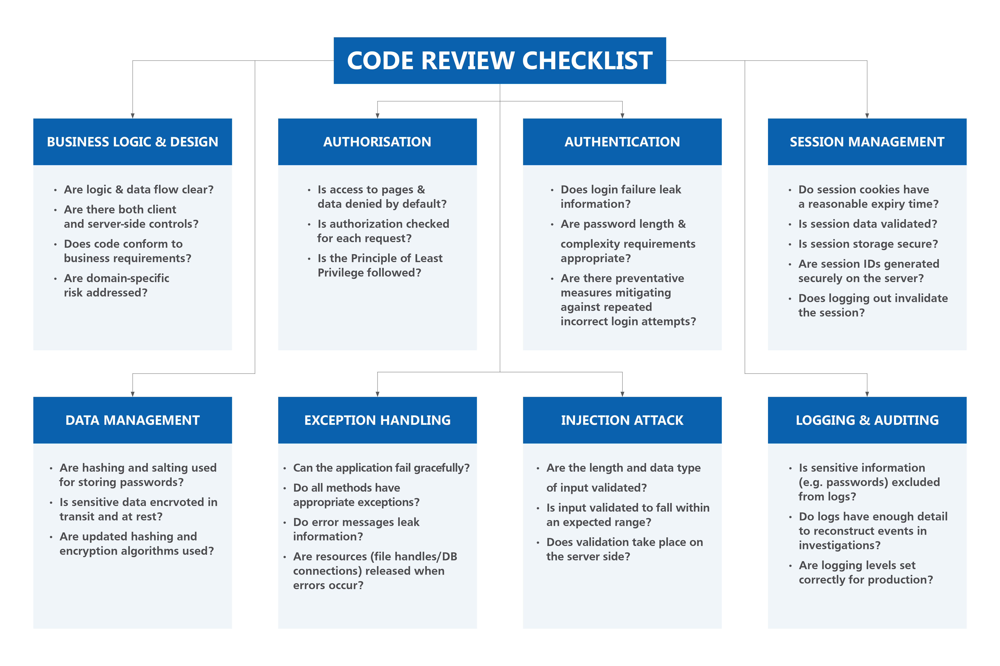

# Secure Code Review Guideline

**Disclaimer**: This document serves only as a guideline and the examples shown are non-exhaustive. Please apply the following defenses on a case-by-case basis. For more information, please visit: https://owasp.org/www-pdf-archive/OWASP_Code_Review_Guide_v2.pdf

## What is Secure Code Review
Secure code review identifies flaws in application features and design to help ensure that software is developed with security in mind. This is done by auditing the source code for security and logical controls.

Some factors to consider when reviewing code include:
- Application feature & business rules
- Context, such as data sensitivity level
- User roles and access rights
- Application type
- Programming language & frameworks used
- Design patterns used

It is recommended that secure code review is practiced before merging a pull request.

## Secure Code Review Checklist Summary


## Focus Areas

### Authentication
Authentication vulnerabilities allow malicious users to gain access to functionalities that we wish to protect.

<details>
<summary>Click here for more information</summary>

#### Types of Vulnerabilities
- **Brute-force password guessing**: common and weak passwords (e.g. `Password123!`) can be easily guessed in such attacks
- **Flawed two-factor verification logic**: if not implemented correctly, users may be able to skip to logged-in only pages after completing only the first step of authentication. 

    For instance, a user logs in to a vulnerable website with his/her credentials. 
    ```
    POST /login/first_part
    Host: example.com

    username=adam&password=StronkP@ssw0rd!
    ```

    He/She is then assigned an `account` cookie (which is simply the username, e.g. `cookie=adam`), before being asked for a verification code. 
    ```
    HTTP/1.1 200 OK
    Set-Cookie: cookie=adam

    GET /login/second_part 
    Cookie: cookie=adam
    ```
    
    When submitting the verification code, the request uses this cookie to determine which account the user is trying to access. Using tools like `burpsuite`, attacker can log in with his/her own credentials, intercept the response, and change the value of the  `account` cookie to any arbitray username when submitting the verification code to gain access to that user's account.
    ``` bash
    POST /login/first_part
    Host: example.com

    username=attacker&password=AttackerPassword!

    POST /login/second_part
    Host: example.com
    Cookie: cookie=adam # attacker can now login as adam

    verification_code=123456
    ```
</details>

#### Review Checklist
- [ ] Ensure secure password policy is enforced. 
- [ ] Ensure least privilege principle is adopted.
- [ ] Ensure temporary account lockouts and rate-limiting are adopted to prevent brute-force attacks.

### Authorization
Authorization vulnerabilities allow malicious user to perform unwanted actions on otherwise protected resources.

<details>
<summary>Click here for more information</summary>

#### Types of Vulnerabilities
- **Insecure direct object reference**: arises when an application provides direct access to objects (e.g. database records, internal URLs, files) based on user-supplied input without authorization checks
    ```python
    @app.get("/profile/{user_id}")
    def get_user_by_id(user_id: int):
        user = db.query(User).filter(User.id == user_id).first()
        if user is None:
            raise HTTPException(status_code=404, detail="User not found")
        return user
    ```

  A malicious user can access another user's profile if he/she knows the `user_id` by simply navigating to `http://www.example.com/profile/{user_id}`.

- **Missing function level access control**: if access to protected functions are not properly verified (e.g. verification is only done at the UI level), a malicious user can still send requests to these protected functions and they will still be processed, even though the resultant view is denied to the user.
    ```python
    # assuming authorization check is done only on the UI level
    @app.get("/update_exam_score")
    def update_exam_score():
        # authorization check should have been done here before proceeding
        # e.g. this function should only be accessible after logging in with admin credentials
        request_args = request.args.to_dict()
        student_id = request_args.get("student_id")
        score = request_args.get("score")

        student = db.query(student).filter(student.id == student_id).first()
        if student is None:
            raise HTTPException(status_code=404, detail="student not found")
        student.score = score
        return student
    ```
  When a malicious user sends a request via `curl http://www.example.com/update_exam_score?student_id=123456&score=100`, student with `student_id = 123456` will have his exam score updated to `100`.

</details>

#### Review Checklist 
- [ ] Ensure all locations where user input is used to reference objects directly are equipped with authorisation checks. 
- [ ] Ensure all entry points are properly authorized.
- [ ] For functions with higher risk, multiple levels of authorization checks can be considered.

### Business Logic & Design
Business logic vulnerabilities are flaws in the design and implementation of an application that allow for unintended behaviours.

<details>
<summary>Click here for more information</summary>

#### Types of Vulnerabilities
- **Injection attack**: allows a malicious user to add/inject content into an application to modify its behaviours. 
    ```python
    user = form.get('user')
    bidding_price = form.get('bidding_price') # business validation should have been done here to ensure input conforms to expected range
    bidding_price_dict.update({user:bidding_price})
    sorted_bidding_price_dict = {k: v for k, v in sorted(bidding_price_dict.items(), key=lambda item: -item[1])}
    highest_bidder = list(sorted_bidding_price_dict.item())[0]
    ```
  The vulnerability arises due to assumptions that users will only input valid amounts. However, malicious users can collude and only input zero/negative values. The resulting `sorted_bidding_price_dict` will look like this:
    ```python
    sorted_bidding_price_dict = {
      "user_a": 0,
      "user_b": -2,
      "user_3": -10
    }
    ```
  The attacker can bid for the object without paying for it.
- **Business logic errors**: failure to align to business context, allowing unintended processing to take place
  ```python
  voucher_discount = {
    "code_1": 10,
    "code_2": 30,
    "code_3": 50
  }
  voucher_code = form.get('voucher_code') # voucher discount
  discount_amount = form.get('discount_amount') # promotion discount
  voucher_discount_amount = voucher_discount.get(voucher_code)
  final_price = original_price - discount_amount - voucher_discount_amount
  ```
  The above code applies discount to an item before a user checks out his/her cart. In this case, there is a voucher discount and a promotional discount. The business requirement is that only one of the two discounts may be applied. Double discount is not allowed.

  However, failure to translate the above business requirement into code allows for double discount, allowing users to get more discount than what should have been allowed.

</details>

#### Review Checklist
- [ ] Ensure all business logic and data flow are clear and aligned with business requirements. 
- [ ] Make use of business validation to limit value ranges and input options to values that make sense for the business context.

### Data Management
Sensitive data such as IC numbers deserve extra protection, including encryption at rest and in transit.

<details>
<summary>Click here for more information</summary>

#### Types of Vulnerabilities
- **Weak cryptography**: adoption of weak encryption algorithms (e.g. `DES`) can be easily cracked via brute-force mechanisms
- **Hardcoding credentials**: hard coding of credentials and committing them can lead to massive security breaches via password guessing exploits

</details>

#### Review Checklist
- [ ] Ensure standard encryption algorithm (e.g. `AES`) is adopted.
- [ ] Ensure `SSL/TLS` is used for protecting data in transit.
- [ ] Ensure no credentials are hardcoded and committed, and that they are stored in secure locations.

### Exception Handling
Improper exception handling can lead to leaking of valuable information.

<details>
<summary>Click here for more information</summary>

#### Types of Vulnerabilities
- **Revealing internal error messages**: this can provide malicious user important clues regarding the application. Examples include:
    ```
    - stack traces
    - database dumps
    - error codes
    ```
- **Insecure state due to exception**: initial failure may cause the application to enter an insecure state. Examples include:
    ```
    - resources not locked down and released
    - sessions not terminated properly
    - continuous processing of business logic despite exception
    ```

</details>

#### Review Checklist
- [ ] Ensure error messages do not reveal extra information to user.
- [ ] Ensure all exits from a function, including exceptions, are covered.
- [ ] Ensure that a generic error page is used for all exceptions if possible.

### Injection Attack
Injection attack allows a malicious user to add/inject content into an application to modify its behaviours. 

<details>
<summary>Click here for more information</summary>

#### Types of Vulnerabilities
- **SQL Injection**: modifies queries that an application makes to the database
    ```python
    username = form.get("username")
    password = form.get("password")
    query = "select * from users where username="+username+" and password="+password+";"
    db_cursor.execute(query)
    ```
  The vulnerability arises due to assumptions that users will only input valid credentials. However, malicious users can input the following to gain access to admin account:
    ```
    username = "admin OR 1=1 #"
    password= ""
    query = select * from users where username=admin OR 1=1 # and password='';
    ```
  The `OR 1=1` condition will always return `TRUE`, and the `#` comments out the rest of the query. In essence, the query becomes `select * from users where username=admin`, and malicious user can login as admin.

</details>

#### Review Checklist
- [ ] Ensure all inputs are validated and sanitized in terms of characters used and length of input, and that these inputs conform to expectations. 
- [ ] Ensure input validation are done on the server side to prevent modification via man-in-the-middle attack.

### Logging & Auditing
Application log messages are important for auditing purposes, and hence proper logging is important.

<details>
<summary>Click here for more information</summary>

#### Types of Vulnerabilities
- **Sensitive data exposure**: sensitive data such as IC number and credentials should not be logged down in plain text
- **Denial of Service**: malicious user can take advantage of excessive logging to deplete system resources by filling up disk space
- **Log injection**: without proper sanitization, invalid user input may be injected into logs, leading to log forging and even code execution via log file poisoning.
    ```python
    val = request.getParameter("val");
    try:
        value = int(val)
    except NumberFormatException:
        log.info("Failed to parse val = " + val)
    ```
  A malicious user can submit this string `twenty-one%0a%0aINFO:+User+logged+out%3dbadguy` and the log will look like the follwing, hence creating forged entries:
    ```
    INFO: Failed to parse val=twenty-one

    INFO: User logged out=badguy
    ```

</details>

#### Review Checklist
- [ ] Ensure that logs are not exposed in web-accessible locations, and if done so, should have restricted access and be configured with a plain text MIME.
- [ ] Ensure that log masking is adopted for logging sensitive data.
- [ ] Ensure that there are no user functions that allow for excessive logging.

### Session Management
Session management is needed by applications to retain information about each user for the duration of multiple requests.

<details>
<summary>Click here for more information</summary>

#### Types of Vulnerabilities
- **Session hijacking**: malicious user can steal someone else's session ID and use it to impersonate that user
    ```python
    @app.get("/sessions/{session_id}")
    def get_session(session_id: str):
        session_obj = sessions.get(session_id)
        return session_obj
    ```
  The code above is vulnerable as `session_id` is exposed in URL and there are no authentication and authorization checks.

- **Session fixation**: Set someone else's session ID to a predefined value and impersonating them using that known value

- **Session elevation**: this vulnerability occurs when the importance of a session has changed (e.g. after user logs in), but the session ID remains the same

</details>

#### Review Checklist
- [ ] Ensure that session IDs are placed in cookies, and these cookies are HTTP-Only.
- [ ] Ensure that a warning is displayed when an active session is accessed from another location.
- [ ] Ensure that session ID can only be generated by the application server.
- [ ] Ensure that a session is rolled (i.e. creating a new session ID and transferring session information over) whenever a session is elevated.